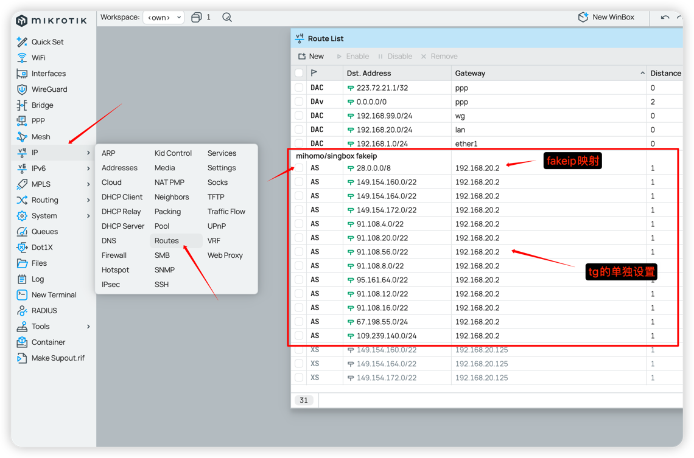
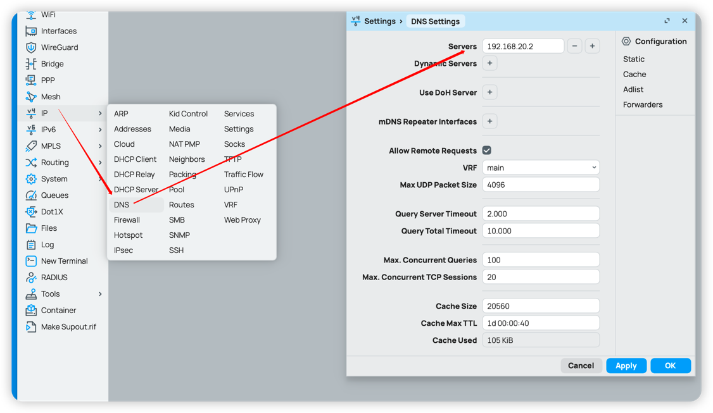
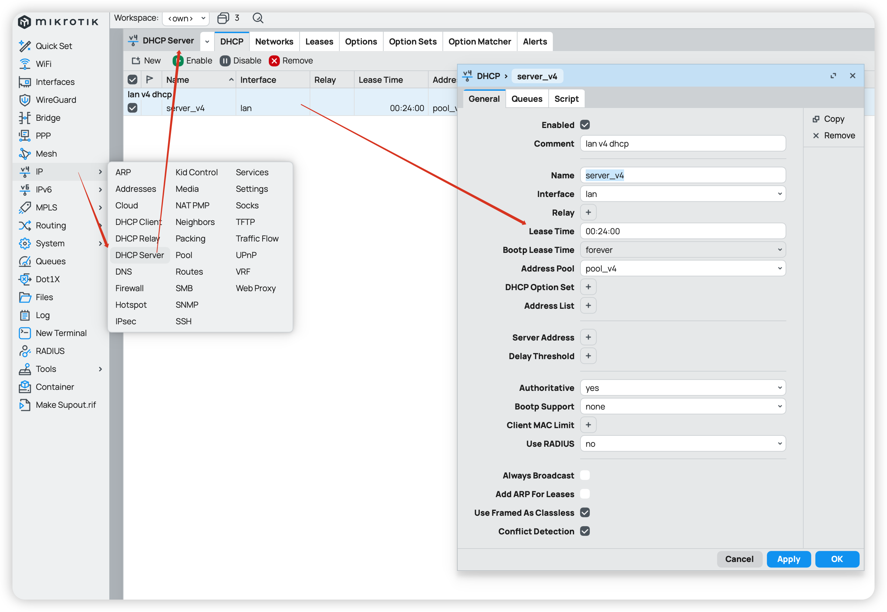
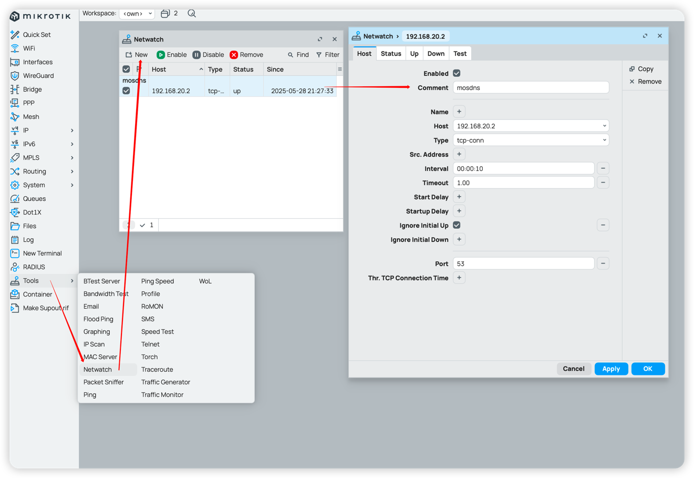
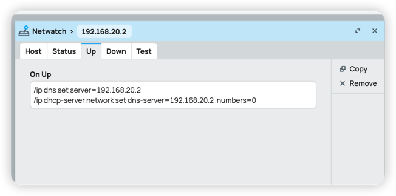
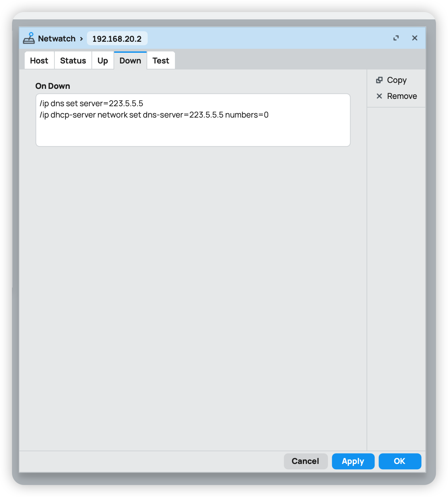

## ROS + FakeIP 使用配置示例

本文档以 ROS（RouterOS）软路由环境为例，说明如何搭配 sing-box + mihomo + mosdns 实现 DNS 分流及故障自动切换。

### 网络环境说明

* RouterOS IP：`192.168.20.1`
* sing-box + mihomo + mosdns 所在主机 IP：`192.168.20.2`
* 默认上游 DNS（备用）：`223.5.5.5`

---

### 步骤一：确保 RouterOS 能够正常上网

确保 RouterOS 已连接外网，当前 DNS 设置为 `223.5.5.5`，并能正常访问互联网。

---

### 步骤二：配置 Route List

在 WinBox 或 WebFig 中，进入 `IP > Routes`，添加如下 Route 规则：


    命令示例:
    ```shell
    /ip route
    add comment="mihomo/singbox fakeip" disabled=no distance=1 dst-address=28.0.0.0/8 gateway=192.168.20.2 routing-table=main scope=30 suppress-hw-offload=no target-scope=10
    add disabled=no distance=1 dst-address=149.154.160.0/22 gateway=192.168.20.2 scope=30 suppress-hw-offload=no target-scope=10
    add disabled=no distance=1 dst-address=149.154.164.0/22 gateway=192.168.20.2 scope=30 suppress-hw-offload=no target-scope=10
    add disabled=no distance=1 dst-address=149.154.172.0/22 gateway=192.168.20.2 scope=30 suppress-hw-offload=no target-scope=10
    add disabled=no distance=1 dst-address=91.108.4.0/22 gateway=192.168.20.2 scope=30 suppress-hw-offload=no target-scope=10
    add disabled=no distance=1 dst-address=91.108.20.0/22 gateway=192.168.20.2 scope=30 suppress-hw-offload=no target-scope=10
    add disabled=no distance=1 dst-address=91.108.56.0/22 gateway=192.168.20.2 scope=30 suppress-hw-offload=no target-scope=10
    add disabled=no distance=1 dst-address=91.108.8.0/22 gateway=192.168.20.2 scope=30 suppress-hw-offload=no target-scope=10
    add disabled=no distance=1 dst-address=95.161.64.0/22 gateway=192.168.20.2 scope=30 suppress-hw-offload=no target-scope=10
    add disabled=no distance=1 dst-address=91.108.12.0/22 gateway=192.168.20.2 scope=30 suppress-hw-offload=no target-scope=10
    add disabled=no distance=1 dst-address=91.108.16.0/22 gateway=192.168.20.2 scope=30 suppress-hw-offload=no target-scope=10
    add disabled=no distance=1 dst-address=67.198.55.0/24 gateway=192.168.20.2 scope=30 suppress-hw-offload=no target-scope=10
    add disabled=no distance=1 dst-address=109.239.140.0/24 gateway=192.168.20.2 scope=30 suppress-hw-offload=no target-scope=10
    ```

---

### 步骤三：设置 DNS 和 DHCP

1. 修改 DNS 服务器：

    * 路由器 DNS 设置改为：`192.168.20.2`
2. DHCP Server 配置：

    * 将分发给客户端的 DNS 改为：`192.168.20.2`
    * 可根据实际情况设定较短的租约时间（如 3 分钟），方便 mosdns 挂掉时快速回退。

   示例截图：





---

### 步骤四：添加 Netwatch 事件监听

进入 `Tools > Netwatch`，设置目标 IP（如 1.1.1.1），并配置当目标 IP 不可达时自动切换 DNS。

#### up 参数（目标 IP 恢复时执行）

```shell
/ip dns set server=192.168.20.2
/ip dhcp-server network set dns-server=192.168.20.2 numbers=0
```

#### down 参数（目标 IP 不可达时执行）

```shell
/ip dns set server=223.5.5.5
/ip dhcp-server network set dns-server=223.5.5.5 numbers=0
```

示意图：







---

以上配置完成后，RouterOS 将会优先使用 mosdns 作为主 DNS，当 mosdns 失效时自动切换至备用 DNS（如 223.5.5.5），实现更高的网络稳定性。
